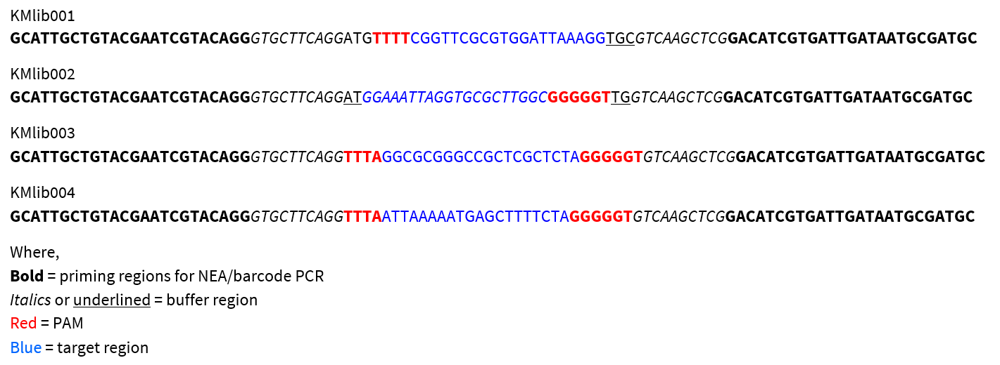

# Experimental Design

## Generating the mis-match count table and positional nucleotide frequency matrix

The input is a fastq file. The R2 reads (reverse reads) have a 20bp target sequences with 0 to 20 mismatches, with targets containing 2 or 3 mismatches maximally represented in the pool. The flanking sequence is constant which is trimmed before processing the target sequences. Once target sequences are extracted, the number of mismatches in the sequences are computed and the frequency of nucleotides at each position is calculated.

## Experiment

Three different libraries were used in this experiment:

| Library | name | Cas12 | Cas9|
| -- | -- | --| -- |
|pLibrary PS4 |(KMlib001) |Cas12a| |
|pLibrary PS4 |(KMlib002)|| Cas9 |
|pLibrary EMX1 |(KMlib003)| Cas12av|Cas9 |
|pLibrary CCR5 |(KMlib004) |Cas12a|Cas9|

Each of these libraries were tested with three orthologs of Cas12a (FnCas12a, LbCas12a and AsCas12a) and were identified with the first 2 letters (Fn, Lb, and As).

Design of the oligos were as follows

Fig1: Sequence features.
