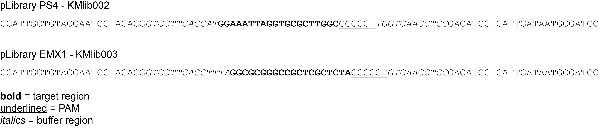

# Generating the mis-match count table and positional nucleotide frequency matrix

The input is a fastq file. The R1 and R2 reads have a 20bp target sequences with 0 to 10 mismatches, with targets containing 2 to 4 mismatches maximally represented in the pool. The flanking sequence is constant which is trimmed before processing the target sequences. Once target sequences are extracted, the number of mismatches in the sequences are computed and the frequency of nucleotides at each position is calculated.

## Experiment

Two different libraries were used in this experiment:

1. pLibrary PS4 (KMlib002)
2. pLibrary EMX1 (KMlib003)

Each of these libraries were tested with five Cas9 Variants (`SpCas9`, `SaCas9`, `SpCas9 HF1`,`HypaCas9` ,  and `IDT HiFi Cas9`) and were identified with the first 2 letters (`Sp`, `Sa`, `HF1`, `Hypa` and `IDT or HiFi`).

Design of the oligos were as follows

Fig1: Sequence features.
