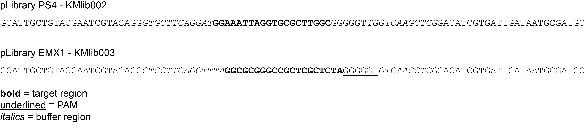
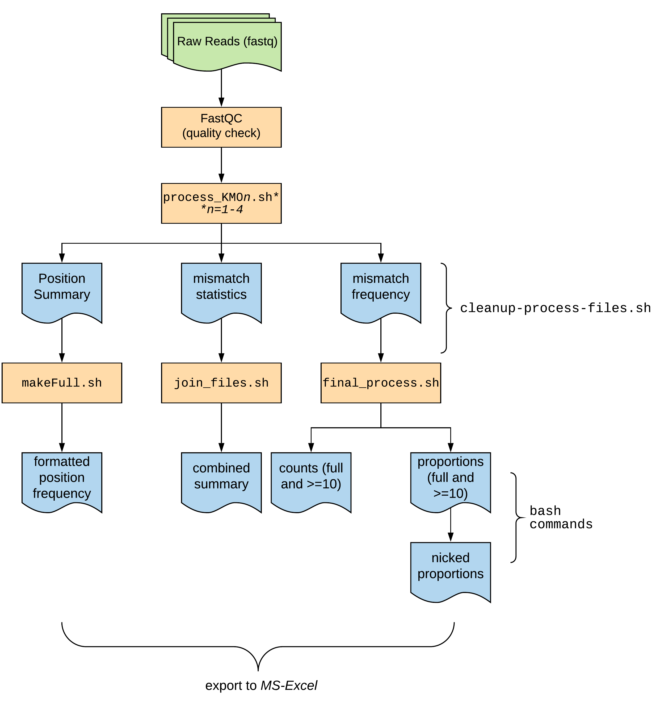

# Generating the mis-match count table and positional nucleotide frequency matrix

The input is a fastq file. The R1 and R2 reads have a 20bp target sequences with 0 to 10 mismatches, with targets containing 2 to 4 mismatches maximally represented in the pool. The flanking sequence is constant which is trimmed before processing the target sequences. Once target sequences are extracted, the number of mismatches in the sequences are computed and the frequency of nucleotides at each position is calculated.

## Experiment

Two different libraries were used in this experiment:

1. pLibrary PS4 (KMlib002)
2. pLibrary EMX1 (KMlib003)

Each of these libraries were tested with five Cas9 Variants (`SpCas9`, `SaCas9`, `SpCas9 HF1`,`HypaCas9` ,  and `IDT HiFi Cas9`) and were identified with the first 2 letters (`Sp`, `Sa`, `HF1`, `Hypa` and `IDT or HiFi`).

Design of the oligos were as follows

Fig1: Sequence features.


## Workflow




## Data

Data was securely `rsync`ed from the PI's [LSS](https://researchit.las.iastate.edu/large-scale-storage-lss) server to the Condo cluster. The files were organized based on library name and then Cas9 variant.

```bash
rsync --progress -rts /../../*fastq* ./
for fq in *.gz; do
gunzip $fq;
done
while read a b; do
  rename ${a} ${b} ${a}*.fastq;
done<index.txt
for f in $(ls *fq |cut -f 2 -d "_" |sort ); do
  mkdir -p $f;
  mv *${f}*fq $f/;
done
```

_`index.txt` file can be found [here](other-files/index.txt)_


## Quality Check

In an interactive session, `fastqc` was run on all fastq files and `multiqc` to collate them together as follows:

```bash
salloc -N 1 -n 16 -t 8:00:00
parallel "fastqc {}" ::: */*.fq
for dir in strain*; do
  cd $dir
  multiqc .
  cd ..
done
```

The html files are also available in other-files folder of this repo.


## Processing files

For each library, separate processing script was generated and ran on respective files. For organization purpose, the files belonging to each library were kept in separate folders.

The processing commands were ran as follows:

```bash
cd /work/GIF/arnstrm/Dipa/01-analysis
./link.sh
mkdir -p KM01 KM03 KM04
mv *-KMlib001-* ./KM01
mv *-KMlib003-* ./KM03
mv *-KMlib004-* ./KM04
# process KM01
cd KM01
for fq in *.fq; do
  ../process_KM01.sh $fq;
done &>stdout.txt
# process KM03
cd ../KM03
for fq in *.fq; do
  ../process_KM03.sh $fq;
done &>stdout.txt
# process KM04
cd ../KM04
for fq in *.fq; do
  ../process_KM04.sh $fq;
done &>stdout.txt
```

These scripts generates 4 sets of files for every fastq file.

| File                          | Contents                                                                             |
|:------------------------------|:-------------------------------------------------------------------------------------|
| PREFIX_pos-summary.txt        | frequency of nucleotides at each position                                            |
| PREFIX_mm-stats.txt           | 2-column table listing all kmer and its mis-matches to the correct sequence          |
| PREFIX_mismatches_summary.txt | condensed PREFIX_mm-stats.txt table, summrizing total kmers found for each mis-match |
| PREFIX_freq.txt               | 2-column table with kmer and number of times it is seen in the file                  |


The next task is to combine these files and make unified file for each of the above file. This was done for each library, as follows:

```bash
# cleanup files, putting them in different folders:
for KM in KM01 KM03 KM04; do
  cd $KM
  ../cleanup-process-files.sh
  cd ..
done
# process frequency table files
for KM in KM01 KM03 KM04; do
  cd $KM/frequency-table
  ../../makefull.sh
  cd ..
done
# process mismatch-summary table files
for KM in KM01 KM03 KM04; do
  cd $KM/mismatches-table
  ../../pad_and_merge-mismatches.sh
  cd ..
done
# makes mismatch_summary_combined.txt file
```

Final processing of files were done as follows:

```bash
cd KM01/frequency-table
../../final-process-KM01.sh
cd -
cd KM03/frequency-table
../../final-process-KM03.sh
cd -
cd KM04/frequency-table
../../final-process-KM04.sh
cd -
```
The script generates following files:

| File                                    | Contents                                                             |
|-----------------------------------------|----------------------------------------------------------------------|
| final_counts-mismatch-one-only.txt      | kmer counts per file, combined across all samples of that library    |
| final_proportions-mismatch-one-only.txt | same as above, but as proportions normalized for each sample         |
| final_counts-total-counts-ge10.txt      | filtered table with only kmers total sum greater than or equal to 10 |
| final_proportions-total-counts-ge10.txt | same as above, but as proportions normalized for each sample         |

The tables were then exported to excel and manipulated there.

## Summary tables


Commands used to generate summary tables are as follows:

Process KM01

```bash
cd KMlib001/
mkdir Fig3
cd Fig3/
cp ../KMlib001_proportions-total-counts-ge10.txt ./
head -n 1 KMlib001_proportions-total-counts-ge10.txt  |tr "\t" "\n" |nl
cut -f 2-8,24-38 KMlib001_proportions-total-counts-ge10.txt > As_KMlib001_nicked_proportions_ge10.txt
cut -f 2-6,39-40,56-70 KMlib001_proportions-total-counts-ge10.txt > Lb_KMlib001_nicked_proportions_ge10.txt
cut -f 2-6,71-72,88-102 KMlib001_proportions-total-counts-ge10.txt > Fn_KMlib001_nicked_proportions_ge10.txt
cd ../../KMlib001/Fig3/
for f in hd_*; do
  sed -i 's/KMlib003/KMlib001/g' $f;
done
for f in *.txt; do
  awk 'BEGIN {FS=OFS="\t"}{print $1,$2,($5+$6+$7)/3,($8+$9+$10)/3,($11+$12+$13)/3,($14+$15+$16)/3,($17+$18+$19)/3,($20+$21+$22)/3}' $f > ${f%.*}_avg.txt;
done
for f in *_avg.txt; do
  awk 'NR>1' $f > $f.1;
done
rm *_avg.txt
cat hd_as As_KMlib001_nicked_proportions_ge10_avg.txt.1 >> As_KMlib001_nicked_proportions_ge10_avg.txt
cat hd_fn Fn_KMlib001_nicked_proportions_ge10_avg.txt.1 >> Fn_KMlib001_nicked_proportions_ge10_avg.txt
cat hd_lb Lb_KMlib001_nicked_proportions_ge10_avg.txt.1 >> Lb_KMlib001_nicked_proportions_ge10_avg.txt
mv values.txt as_values.txt
```

Process KM03
```
cd ../../KMlib003/
mkdir Fig3
cd Fig3
cp ../KMlib003_proportions-total-counts-ge10.txt ./
head -n 1 KMlib003_proportions-total-counts-ge10.txt |tr "\t" "\n" |nl
cut -f 2-8,24-38 KMlib003_proportions-total-counts-ge10.txt > As_KMlib003_nicked_proportions_ge10.txt
cut -f 2-5,39-41,57-71 KMlib003_proportions-total-counts-ge10.txt > Fn_KMlib003_nicked_proportions_ge10.txt
cut -f 2-5,72-74,90-104 KMlib003_proportions-total-counts-ge10.txt > Lb_KMlib003_nicked_proportions_ge10.txt
cd ../../KMlib003/Fig3/
rm KMlib003_proportions-total-counts-ge10.txt
for f in *.txt; do
  awk 'BEGIN {FS=OFS="\t"}{print $1,$2,($5+$6+$7)/3,($8+$9+$10)/3,($11+$12+$13)/3,($14+$15+$16)/3,($17+$18+$19)/3,($20+$21+$22)/3}' $f > ${f%.*}_avg.txt;
done
head As_KMlib003_nicked_proportions_ge10_avg.txt
for f in *_avg.txt; do
  awk 'NR>1' $f > $f.1;
done
for f in hd_*; do
  sed -i 's/KMlib004/KMlib003/g' $f;
done
rm As_KMlib003_nicked_proportions_ge10_avg.txt Fn_KMlib003_nicked_proportions_ge10_avg.txt Lb_KMlib003_nicked_proportions_ge10_avg.txt
rm As_KMlib003_nicked_proportions_ge10.txt
cat hd_as As_KMlib003_nicked_proportions_ge10_avg.txt.1 >> As_KMlib003_nicked_proportions_ge10_avg.txt
cat hd_fn Fn_KMlib003_nicked_proportions_ge10_avg.txt.1 >> Fn_KMlib003_nicked_proportions_ge10_avg.txt
cat hd_lb Lb_KMlib003_nicked_proportions_ge10_avg.txt.1 >> Lb_KMlib003_nicked_proportions_ge10_avg.txt
rm *.1
cp ../KMlib003_proportions-total-counts-ge10.txt ./
cut -f 2-8,24-38 KMlib003_proportions-total-counts-ge10.txt > As_KMlib003_nicked_proportions_ge10.txt
mv hd_* ../../KMlib001/Fig3/
```

Process KM04
```
cd ../../KMlib004/
mkdir Fig3
cd Fig3
cp ../KMlib004_proportions-total-counts-ge10.txt ./
head -n 1 KMlib004_proportions-total-counts-ge10.txt |tr "\t" "\n" |nl
cut -f 2-8,24-38 KMlib004_proportions-total-counts-ge10.txt > As_KMlib004_nicked_proportions_ge10.txt
cut -f 2-5,39-41,57-71 KMlib004_proportions-total-counts-ge10.txt > Fn_KMlib004_nicked_proportions_ge10.txt
cut -f 2-5,72-74,90-104 KMlib004_proportions-total-counts-ge10.txt > Lb_KMlib004_nicked_proportions_ge10.txt
cd ../../KMlib004/Fig3/
head -n 1 As_KMlib004_nicked_proportions_ge10.txt |tr "\t" "\n" |nl
rm KMlib004_proportions-total-counts-ge10.txt
for f in *.txt; do
  awk 'BEGIN {FS=OFS="\t"}{print $1,$2,($5+$6+$7)/3,($8+$9+$10)/3,($11+$12+$13)/3,($14+$15+$16)/3,($17+$18+$19)/3,($20+$21+$22)/3}' $f > ${f%.*}_avg.txt;
done
echo -e "kmer\tMisMatches\tLb-KMlib004-1\tLb-KMlib004-3\tLb-KMlib004-5\tLb-KMlib004-7\tLb-KMlib004-9\tLb-KMlib004-11" > hd_lb
echo -e "kmer\tMisMatches\tAs-KMlib004-1\tAs-KMlib004-3\tAs-KMlib004-5\tAs-KMlib004-7\tAs-KMlib004-9\tAs-KMlib004-11" > hd_as
echo -e "kmer\tMisMatches\tFn-KMlib004-1\tFn-KMlib004-3\tFn-KMlib004-5\tFn-KMlib004-7\tFn-KMlib004-9\tFn-KMlib004-11" > hd_fn
for f in *_avg.txt; do
  awk 'NR>1' $f > $f.1;
done
cat hd_lb Lb_KMlib004_nicked_proportions_ge10_avg.txt.1 >> Lb_KMlib004_nicked_proportions_ge10_avg.txt
cat hd_as As_KMlib004_nicked_proportions_ge10_avg.txt.1 >> As_KMlib004_nicked_proportions_ge10_avg.txt
cat hd_fn Fn_KMlib004_nicked_proportions_ge10_avg.txt.1 >> Fn_KMlib004_nicked_proportions_ge10_avg.txt
rm *.1
mv hd_* ../../KMlib003/Fig3/
```
